<!-- ====== HERO (center piece) ====== -->

<!-- ====== AROUND THE CENTER ====== -->
<table align="center" width="100%">
<tr>
<td width="50%" valign="top">

### 🙋 About Me

- 🔭 I'm **DommieAly**, a full-stack developer who loves turning ideas into products.
- 🌱 Currently leveling up on **system design** & **AI tooling**.
- 💬 Ask me about **TypeScript, React, Python, Cloud**.
- ⚡ Fun fact: I color my name 🟥🟥🟥🟨🟨🟨🟦🟦🟦.

</td>
<td width="50%" valign="top">

### 🧰 Tech Stack

</td>
</tr>
</table>

---

<!-- ====== MINI GAME ====== -->

### 🦖 Dino Run

---

<!-- ====== CONNECT (footer ring) ====== -->

### 🌐 Let's Connect

